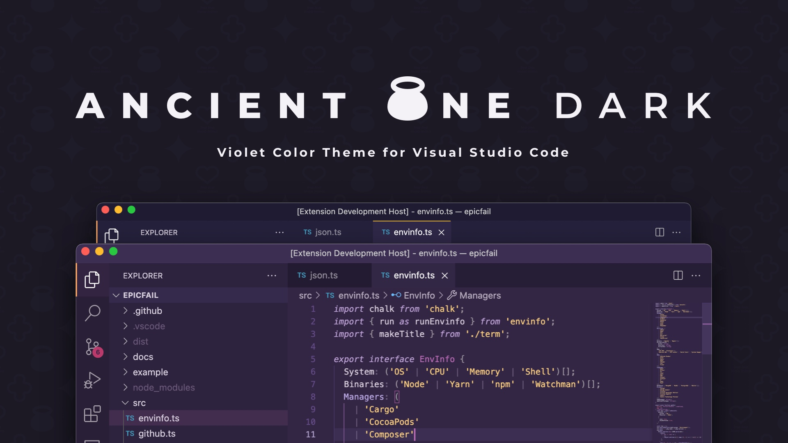

# Ancient One Dark

> Violet color theme for [the ancient ones](https://www.youtube.com/watch?v=8ZdLXELdF9Q).

## Contribute

Found a design glitch? Have ideas to improve the theme? Please [open an issue](https://github.com/holodata/ancient-one-dark/issues) on GitHub, or join `#ancient-one-dark` channel on [holodata Discord](https://holodata.org/discord).

## FAQ

### **Unable to install ... extension because it is not compatible with the current version of VS Code**

Update your VS Code to the latest version to install the theme.
